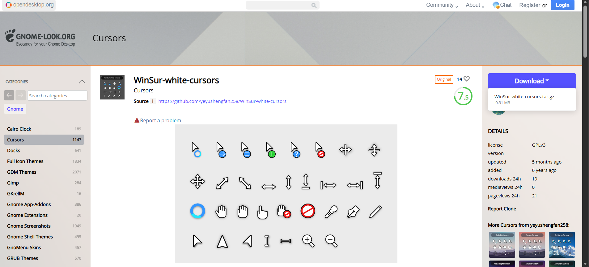
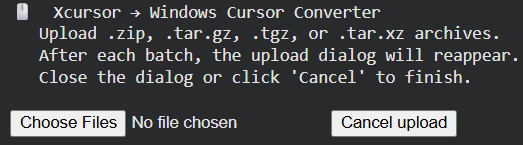
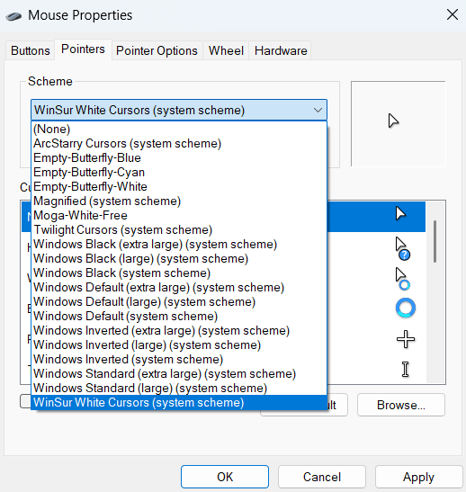

# xcur2win.ipynb
# 🖱️ Xcursor to Windows Cursors – Colab Edition

> **One‑click conversion of Linux cursor themes to Windows `.cur`/`.ani` files – no installation, no terminal, just a browser.**  
> 💡 *Tip: Right‑click the badge above and select “Open in new tab” if you prefer.*

---

## 📖 The Story

There are thousands of beautiful cursor themes for Linux (Xcursor format) on sites like [Gnome‑look.org](https://www.gnome-look.org/browse?cat=107&ord=latest). Windows users, however, are often left out – they can’t use these themes without a tedious manual conversion process.

The excellent [`win2xcur`](https://github.com/quantum5/win2xcur) tool by [quantum5](https://github.com/quantum5) does the heavy lifting, but it requires Python, ImageMagick, and command‑line know‑how. This project wraps `win2xcur` into a **zero‑setup Google Colab notebook** – just upload your theme zip and download the ready‑to‑install Windows package.

**All credit for the actual conversion logic goes to quantum5 – this is merely a friendly front‑end.**

---

## 🚀 How to Use (3 Simple Steps)

### 1️⃣ Get a cursor theme
- Browse [Gnome‑look.org](https://www.gnome-look.org/browse?cat=107&ord=latest) (or any Xcursor theme site).
- Download the `.zip` file of your favourite theme.

### 2️⃣ Convert it with Colab (choose one)

**Option A – One‑click (requires a Google account)**
- Click the **“Open In Colab”** badge above, or use [this direct link](https://colab.research.google.com/github/sarwar-sakib/xcur2win.ipynb/blob/main/xcur2win.ipynb).
- The notebook opens in your browser. **No extra permissions are requested** – only the standard Colab runtime is used.

**Option B – Self‑hosted (no login)**
- Download the [`xcur2win.ipynb`](https://raw.githubusercontent.com/sarwar-sakib/xcur2win.ipynb/main/xcur2win.ipynb) file.
- Go to [Google Colab](https://colab.research.google.com/) and click **File → Upload notebook**.
- Upload the `.ipynb` file you just downloaded.

**Then (for both options):**
- Run the single cell (click the ▶ button or press `Shift+Enter`).
- When prompted, upload the `.zip` file you downloaded from Gnome‑look.

- Wait a few seconds – the converted Windows package will **automatically download** to your computer. A clickable link also appears (opens in a new tab) in case the automatic download doesn’t start.

### 3️⃣ Install on Windows 11 / 10
- Extract the downloaded `.zip` file.
- Right‑click on `install.inf` and choose **Install** (allow admin access if prompted).
- Open **Mouse Properties**:
  - Search for “mouse settings” → “Additional mouse options” → “Pointers” tab.
- Select your new cursor scheme from the dropdown, or manually assign each cursor.
- Click **Apply** and enjoy your new cursors!

---

## 🧠 What’s inside the notebook?

The notebook is a single Python cell that:
- Installs `win2xcur` and its dependencies (ImageMagick) inside Colab.
- Auto‑detects the cursor folder inside any uploaded `.zip` (handles both `cursors/` directories and flat structures).
- Reads the theme name from `index.theme` (or falls back to the folder name).
- Runs `x2wincurtheme` (batch conversion) – if that fails, falls back to individual file conversion.
- Packages all `.cur`/`.ani` files and a valid `install.inf` into a new `.zip` file.
- Triggers the browser download automatically and provides a backup download link.

---

## 🙏 Credits

- **Conversion engine**: [win2xcur](https://github.com/quantum5/win2xcur) by [quantum5](https://github.com/quantum5) – an incredibly useful tool that does all the real work.
- **Packaging & Colab automation**: This repository simply provides a wrapper script to make the process accessible to everyone.

If you find this useful, please star the original win2xcur repository – that’s where the magic happens!

---

## 🤝 Contributing

Found a bug? Have an idea for a simpler flow?  
Feel free to open an issue or submit a pull request. Let’s keep it **simple, portable, and beginner‑friendly**.

---

**Vibe coded using deepseek** 😎
